# Ball Tracking Robot

My project is a ball tracking robot that uses Raspberry Pi to run. It has color detection, built in code, dc motors, and also uses an L298N motor driver to power the motors. This project was an amazing experience for me and I loved building the physical part of it, as well as the coding part of it. 


| **Engineer** | **School** | **Area of Interest** | **Grade** |
|:--:|:--:|:--:|:--:|
| Winston Z | The Quarry Lane School | Computer Science | Incoming Sophomore


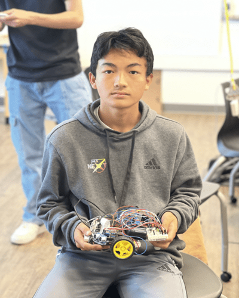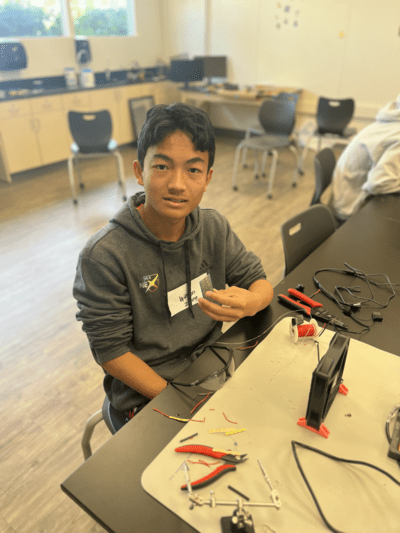
# Final Milestone


<iframe width="560" height="315" src="https://www.youtube.com/embed/J9R5ZfRnESo" title="YouTube video player" frameborder="0" allow="accelerometer; autoplay; clipboard-write; encrypted-media; gyroscope; picture-in-picture; web-share" allowfullscreen></iframe>

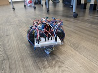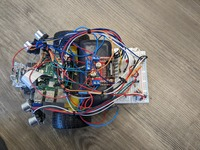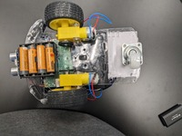

In my first 2 milestones, I got the robot to successfully identify the ball and somewhat follow it around. I also got the ultrasonic sensors working. However, the code had lots of bugs and it sometimes turned randomly. Since then, I have fixed the code and now the robot can accurately follow the ball around without turning randomly or stopping. 

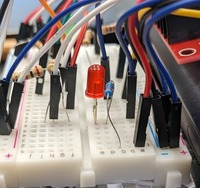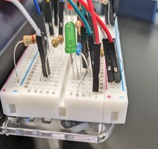

Since my second milestone, I have added 2 LEDs that signify if the ball has been reached or not. The red LED shines if the ball is far away, and the green LED shines if the ball is really close. When the green LED shines, the robot does not move, as it would crash into the ball if it does. 
The robot tracks the ball by finding the center of the ball. It does this by drawing a rectangle around the ball, and then finding the center of the rectangle. If the center of the rectangle/ball is to the left of the camera, then the robot turns left. If it is to the right of the camrea, then it turns right. If it is in the middle, then it moves forward. Once it gets to a certain distance away from the ball(really close), then it stops and the green LED shines. If the ball is not within the camera range, then the robot turns in a circle until it finds the ball. A challenge I faced was that I couldn't get the if statement conditionals right. The robot would turn left even if the ball was right in front of it, and turn left when the ball is to the right. I had to adjust my if statements to check different values of the center of the ball to make it track accurately.


# Second Milestone

<iframe width="560" height="315" src="https://www.youtube.com/embed/QjILRVergfY" title="YouTube video player" frameborder="0" allow="accelerometer; autoplay; clipboard-write; encrypted-media; gyroscope; picture-in-picture; web-share" allowfullscreen></iframe>

For my first milestone, I got the robot to move forward, move backwards, move left, move right, and stop. Since then, I have gotten my robot to somewhat track the ball. However, it still needs some work, as it can only turn left and right while tracking the ball. It can't go forwards or backwards. The camera is also working and is able to identify the ball and mark it.

Components I have added
  - Camera: It tracks the ball. Once the ball is on the camera, it creates a rectangle around the ball so it is easier to track
  - Ultrasonic sensors: I haven't gotten it to work, but I have attached them. They tell the distance that the object is from the sensor. The sensor releases an ultrasonic wave that bounces off the object and back, and we can calculate the distance by using the amount of time the wave takes to come back. My ultrasonic sensors are able to tell the distance, but they are not very accurate right now.
  - Breadboard: The breadboard is a good way to create my circuits on, and it helped me link my ultrasonic sensors to the Raspberry Pi computer using resistors and wires. Breadboards are a great way to create circuits and test them withouth having to solder.

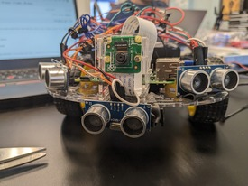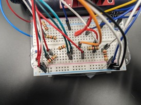

So far, I have started on the ball tracking part and finished with my camera code and movement code. A challenge I faced was getting the camera working. I didn't install it correctly and was not careful with it, so I messed up the pins and ruined the connection between the camera and the Raspberry Pi. Because of this, I had to get a new camera and install everything all over again. Also, the wires for my ultrasonic sensors were not long enough to reach thre front of the car so I had to redo the wires a couple times. My next step is to get the robot fully functioning and tracking the ball, while also adding my modifications. I will add an LED that shines green if the ball is less than a certain distance away, and red if it is further.

# First Milestone

<iframe width="560" height="315" src="https://www.youtube.com/embed/TY900STlwPE" title="YouTube video player" frameborder="0" allow="accelerometer; autoplay; clipboard-write; encrypted-media; gyroscope; picture-in-picture; web-share" allowfullscreen></iframe>

My project is a ball tracking robot. What it does is pretty straightfoward, it tracks a ball and follows it. It consists of a Raspberry Pi Computer, wheels, a L298N motor driver, DC motors, and two battery packs.

Components
  - Raspberry Pi Computer: This is the brain of the robot/car. It processes code and tells the robot what to do. It has a 40 pin pinout, heat sinks, a USBC input, 2 mini HDMIs, 4 USB inputs, and an HDMI input
  - Battery Pack 1: Powers the Raspberry Pi computer
  - Battery Pack 2: Powers the L298N motor driver
  - Motor Driver: It powers the motors. The L298N can control the speed and direction of the motors through the code written in the Raspberry Pi computer. It is connected to the motors and to the Raspberry Pi Computer
  - DC Motors: DC motors run from converting electrical energy to mechanical energy, which makes it run

So far, I have almost completed the physical part of the project and got started on the coding part. For the physical part, I attached everything except the ultrasonic sensors. For the coding part, I have made 5 functions. Stop, move foward, move backwards, move left, and move right. I struggled with booting up the Raspberry Pi computer at first, but after a couple days I started to understand the project better. The wires kept on falling out of the motor driver too, and that was because I did not screw the screw in all the way. My SD Card also got corrupted while I was writing my code, so I had to restart on the coding part. My next step/milestone is to attach the ultrasonic sensors and get them working, and also test out the camera and get started on the code.


  
# Starter Project

<iframe width="560" height="315" src="https://www.youtube.com/embed/MqAtcLB15M0" title="YouTube video player" frameborder="0" allow="accelerometer; autoplay; clipboard-write; encrypted-media; gyroscope; picture-in-picture; web-share" allowfullscreen></iframe>

## Summary
My starter project is a RGB LED light. It displays a color depending on how you slide each of the 3 switches. Each switch controls the one of the RGB values. The further you slide each switch, the higher the value for that specific color gets. For example, if you slide the red switch all the way and none of the other swithces at all, the light will be red because the color is [255,0,0].

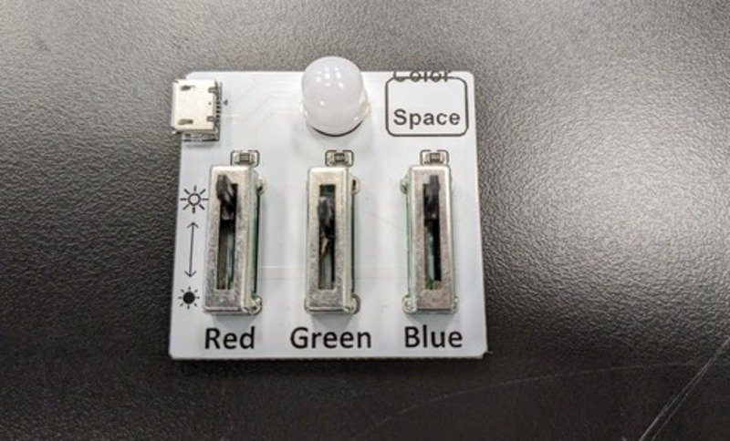

Components
  - RBG LED: The LED displays the light depending on the RBG values
  - Switches: The switches are not on and off switches, they can be slid
  - Red switch: This switch determines the value of the color red from 0-255
  - Green switch: This switch determines the value of the color green from 0-255
  - Blue switch: This switch determines the value of the color blue from 0-255

As you slide the switches, the light changes colors. The light is depedent on the switches. The further you slide the switch, the brighter and stronger that sepcific color gets. You can also mix colors, but the mixed color will look more like the switch that is slid the furthest.

Challenges
  - Had trouble soldering the swithces onto the board
  - The light and the switches were not balanced and kept falling out at first

Next Steps

My next step is to start my intensive project. I will need to figure out where to mark my first and second milestones, and start familiarizing myself with tools around the workshop.

# Schematics 

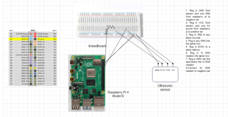

# Code

```python

import RPi.GPIO as GPIO
import time
import cv2
import numpy as np

GPIO.setmode(GPIO.BCM)
GPIO.setwarnings(False)
GPIO_TRIGGER1 = 16      #Left ultrasonic sensor
GPIO_ECHO1 = 20

GPIO_TRIGGER2 = 25      #Front ultrasonic sensor
GPIO_ECHO2 = 8

GPIO_TRIGGER3 = 23      #Right ultrasonic sensor
GPIO_ECHO3 = 24

ledGREEN = 6 #green lED
ledRED = 19 # red LED

MOTOR1B=2  #Left Motor
MOTOR1E=3

MOTOR2B=14  #Right Motor
MOTOR2E=15

#setting up the red and green LEDs
GPIO.setup(ledRED, GPIO.OUT)
GPIO.setup(ledGREEN,GPIO.OUT)

#red LED shines by default
GPIO.output(ledRED,GPIO.HIGH)
GPIO.output(ledGREEN,GPIO.LOW)

# Set pins as output and input
GPIO.setup(GPIO_TRIGGER1,GPIO.OUT)  # Trigger
GPIO.setup(GPIO_ECHO1,GPIO.IN)      # Echo
GPIO.setup(GPIO_TRIGGER2,GPIO.OUT)  # Trigger
GPIO.setup(GPIO_ECHO2,GPIO.IN)
GPIO.setup(GPIO_TRIGGER3,GPIO.OUT)  # Trigger
GPIO.setup(GPIO_ECHO3,GPIO.IN)

# Set trigger to False (Low)
GPIO.output(GPIO_TRIGGER1, False)
GPIO.output(GPIO_TRIGGER2, False)
GPIO.output(GPIO_TRIGGER3, False)

def sonar(GPIO_TRIGGER,GPIO_ECHO):
    #Calculates distance
      start=0
      stop=0
      # Set pins as output and input
      #GPIO.setup(GPIO_TRIGGER,GPIO.OUT)  # Trigger
      #GPIO.setup(GPIO_ECHO,GPIO.IN)      # Echo
     
      # Set trigger to False (Low)
      GPIO.output(GPIO_TRIGGER, False)
     
      # Allow module to settle
      time.sleep(0.001)
           
      #while distance > 5:
      #Send 10us pulse to trigger
      GPIO.output(GPIO_TRIGGER, True)
      time.sleep(0.00001)
      GPIO.output(GPIO_TRIGGER, False)
      begin = time.time()
      while GPIO.input(GPIO_ECHO)==0 and time.time()<begin+0.05:
            start = time.time()
     
      while GPIO.input(GPIO_ECHO)==1 and time.time()<begin+0.1:
            stop = time.time()
     
      # Calculate pulse length
      elapsed = stop-start
      # Distance pulse travelled in that time is time
      # multiplied by the speed of sound (cm/s)
      distance = elapsed * 34300
     
      # That was the distance there and back so halve the value
      distance = distance / 2
     
      # Reset GPIO settings
      return distance

GPIO.setup(MOTOR1B, GPIO.OUT)
GPIO.setup(MOTOR1E, GPIO.OUT)

GPIO.setup(MOTOR2B, GPIO.OUT)
GPIO.setup(MOTOR2E, GPIO.OUT)

#Defining functions for the motors to move
def forward():
      GPIO.output(MOTOR1B, GPIO.HIGH)
      GPIO.output(MOTOR1E, GPIO.LOW)
      GPIO.output(MOTOR2B, GPIO.HIGH)
      GPIO.output(MOTOR2E, GPIO.LOW)
     
def reverse():
      GPIO.output(MOTOR1B, GPIO.LOW)
      GPIO.output(MOTOR1E, GPIO.HIGH)
      GPIO.output(MOTOR2B, GPIO.LOW)
      GPIO.output(MOTOR2E, GPIO.HIGH)
     
def rightturn():
      GPIO.output(MOTOR1B,GPIO.LOW)
      GPIO.output(MOTOR1E,GPIO.HIGH)
      GPIO.output(MOTOR2B,GPIO.HIGH)
      GPIO.output(MOTOR2E,GPIO.LOW)
     
def leftturn():
      GPIO.output(MOTOR1B,GPIO.HIGH)
      GPIO.output(MOTOR1E,GPIO.LOW)
      GPIO.output(MOTOR2B,GPIO.LOW)
      GPIO.output(MOTOR2E,GPIO.HIGH)

def stop():
      GPIO.output(MOTOR1E,GPIO.LOW)
      GPIO.output(MOTOR1B,GPIO.LOW)
      GPIO.output(MOTOR2E,GPIO.LOW)
      GPIO.output(MOTOR2B,GPIO.LOW)
     
def segment_colour(frame):    #returns only the red colors in the frame
    hsv_roi =  cv2.cvtColor(frame, cv2.COLOR_BGR2HSV)
    mask_1 = cv2.inRange(hsv_roi, np.array([160, 160,10]), np.array([190,255,255]))
    ycr_roi=cv2.cvtColor(frame,cv2.COLOR_BGR2YCrCb)
    mask_2=cv2.inRange(ycr_roi, np.array((0.,165.,0.)), np.array((255.,255.,255.)))

    mask = mask_1 | mask_2
    kern_dilate = np.ones((8,8),np.uint8)
    kern_erode  = np.ones((3,3),np.uint8)
    mask= cv2.erode(mask,kern_erode)      #Eroding
    mask=cv2.dilate(mask,kern_dilate)     #Dilating
    return mask

def find_blob(blob): #Finds the center of the circle to track it better
    largest_contour=0
    cont_index=0
    contours, hierarchy = cv2.findContours(blob, cv2.RETR_CCOMP, cv2.CHAIN_APPROX_SIMPLE)
    for idx, contour in enumerate(contours):
        area=cv2.contourArea(contour)
        if (area >largest_contour) :
            largest_contour=area
           
            cont_index=idx
            #if res>15 and res<18:
            #    cont_index=idx
                             
    r=(0,0,2,2)
    if len(contours) > 0:
        r = cv2.boundingRect(contours[cont_index])
       
    return r,largest_contour

def target_hist(frame):
    hsv_img=cv2.cvtColor(frame, cv2.COLOR_BGR2HSV)
   
    hist=cv2.calcHist([hsv_img],[0],None,[50],[0,255])
    return hist

#CAMERA CAPTURE
#initialize the camera and grab a reference to the raw camera capture
video = cv2.VideoCapture(0)
video.set(3,320)
video.set(4,240)
ball_captured = False

flag = 0
while True:
    ret, frame = video.read()

   
   
    global centre_x
    global centre_y
    centre_x=0.
    centre_y=0.
    hsv1 = cv2.cvtColor(frame, cv2.COLOR_BGR2HSV)
    mask_red=segment_colour(frame)      #masking red the frame
    loct,area=find_blob(mask_red)
    #print("Area: " ,area)
    x,y,w,h=loct
    #distance coming from front ultrasonic sensor
    distanceC = sonar(GPIO_TRIGGER2,GPIO_ECHO2)
    print("From center sensor: " + str(distanceC))
      #distance coming from right ultrasonic sensor
    distanceR = sonar(GPIO_TRIGGER3,GPIO_ECHO3)
    print("From right sensor: " + str(distanceR))
    #distance coming from left ultrasonic sensor
    distanceL = sonar(GPIO_TRIGGER1,GPIO_ECHO1)
    print("From left sensor: " + str(distanceL))
   
    if (w*h) < 10:
        #If the width and height is really small, that means it can't find the ball
        found=0
    else:
        #This means it has found the ball
        found=1
        #Creates the rectangle so we can get the center x value and center y value
        #This helps us track it better
        simg2 = cv2.rectangle(frame, (x,y), (x+w,y+h), 255,2)
        centre_x=x+((w)/2)
        centre_y=y+((h)/2)
        cv2.circle(frame,(int(centre_x),int(centre_y)),3,(0,110,255),-1)
        centre_x-=80
        centre_y=6--centre_y
       
    if found == 0:
        #Runs when it doesn't see the ball
        #Checks if there is a wall or any obstacle. if wall is less than 12 cm away, it reverses to avoid crashing
        if distanceC < 9.5:
            reverse()
            time.sleep(0.1)
            stop()
           
        else:
            #Turning in circles to find the ball
            leftturn()
            time.sleep(0.05)
            stop()
    if(found==1):
        if  distanceC<=11 or distanceR<=11 or distanceL <=11:
            #If the ball is really close(less than 11 cm), then we can set the variable to true
            ball_captured = True
        #Happens when the ball is found
        if ball_captured:
            stop()
            #If the robot is really cose to the ball, the green LED shines and the robot doesn't move
            #The robot stops so it doesn't crash into the ball
            GPIO.output(ledGREEN,GPIO.HIGH)
            GPIO.output(ledRED,GPIO.LOW)
            #Sets ball captured back to false so it doesn't stay stationary forever
            ball_captured = False
        else:
            GPIO.output(ledRED,GPIO.HIGH)
            GPIO.output(ledGREEN,GPIO.LOW)
            #The robot has not successfully reached the ball yet, so it runs this
            ball_captured = False
            if area > 200:
                #Checks if the ball is too close. It doesn't want to crash
                if centre_x < 10:
                    #if the center of the ball is on the left of the camera, then it turns left
                    print("left")
                    leftturn()
                    time.sleep(0.04)
                    stop()
                elif centre_x > 170:
                    #if the center of the ball is on the right of the camera, then it turns right
                    print("right")
                    rightturn()
                    time.sleep(0.04)
                    stop()
                elif (area<15250):
                    #if it is somewhat in the middle and the ball isn't too close, then it moves forward
                    print("forward")
                    forward()
               
    if frame is not None:
        cv2.imshow("frame",frame)
    if cv2.waitKey(1) == ord('q'):
        break
video.release()
cv2.destroyAllWindows()
```


# Bill of Materials

| **Part** | **Note** | **Price** | **Link** |
|:--:|:--:|:--:|:--:|
| HC-SR04 Ultrasonic Sensor | Getting the distance between object and the robot | $7.99 | <a href="https://www.amazon.com/BAEASU-Ultrasonic-Mega2560-Duemilanove-Mounting/dp/B0C616H9TS/ref=sr_1_4?crid=2IZ5D2A8Z2ONN&keywords=3+ultrasonic+sensors&qid=1689616349&sprefix=3+ultrasonic+sensos%2Caps%2C825&sr=8-4"> Link </a> |
| L298N Dual H Bridge Motor Driver | Controls the motors | $11.49(2.87 for 1) | <a href="https://www.amazon.com/HiLetgo-Controller-Stepper-H-Bridge-Mega2560/dp/B07BK1QL5T/"> Link </a> |
| Raspberry Pi Kit | Processes code, is the brain of the robot | $104.95 | <a href="https://www.pishop.us/product/raspberry-pi-4b-starter-kit-pro/"> Link </a> |
| Portable Charger Battery Pack  | Powers the Raspberry Pi computer | $26.99 | <a href="https://www.amazon.com/UGREEN-10000mAh-Portable-Charger-Battery/dp/B086Y8P3MT?tag=namespacebran380-20"> Link </a> |
| USB Video Capture Card  | Links the Raspberry Pi to computer/monitor | $16.98 | <a href="https://www.amazon.com/Capture-Streaming-Broadcasting-Conference-Teaching/dp/B09FLN63B3"> Link </a> |
| Ball  | Use this ball to test | $6.99 | <a href="https://www.amazon.com/dp/B003WYZ8DA?ie=UTF8&*entries*=0&viewID=&*Version*=1"> Link </a> |
| Robot Car Kit  | Contains motors, chassis, and wheels | $18.99 | <a href="https://www.amazon.com/Smart-Chassis-Motors-Encoder-Battery/dp/B01LXY7CM3"> Link </a> |
| Keyboard and Mouse  | Use for Raspberry Pi Computer after you link the Pi up to computer | $13.59 | <a href="https://www.amazon.com/Rii-Ultra-slim-Wireless-Multimedia-Raspberry/dp/B07BF3LFN3"> Link </a> |


