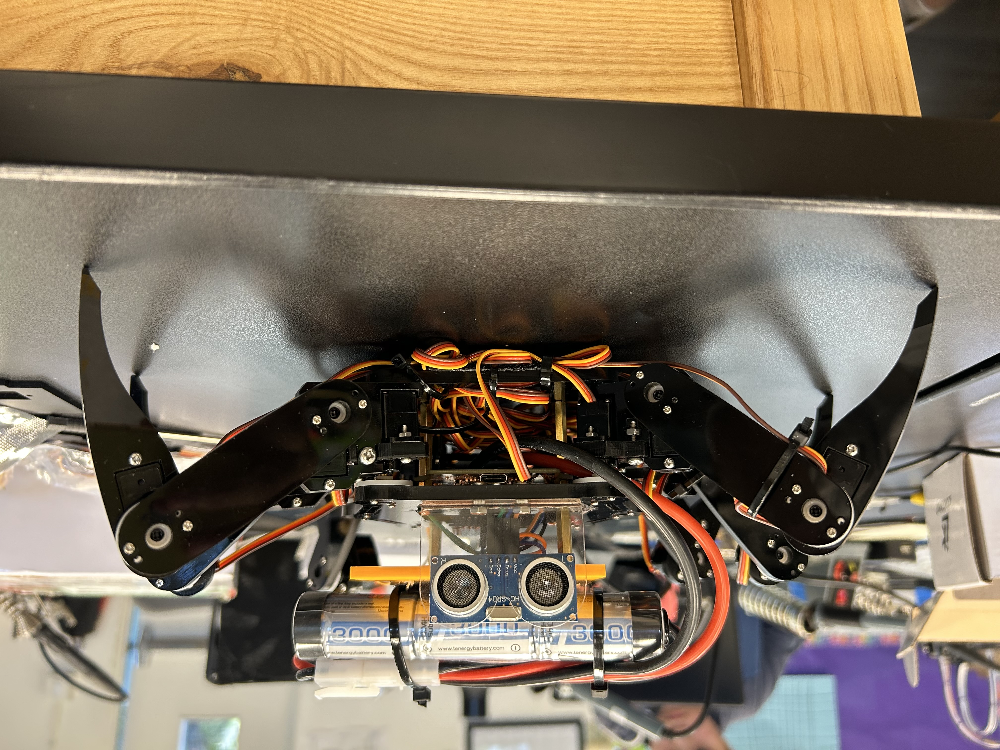
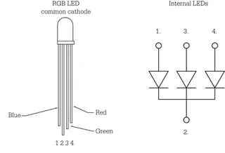
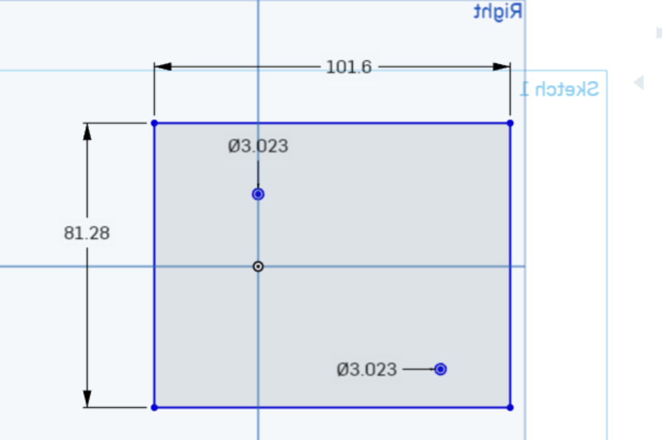
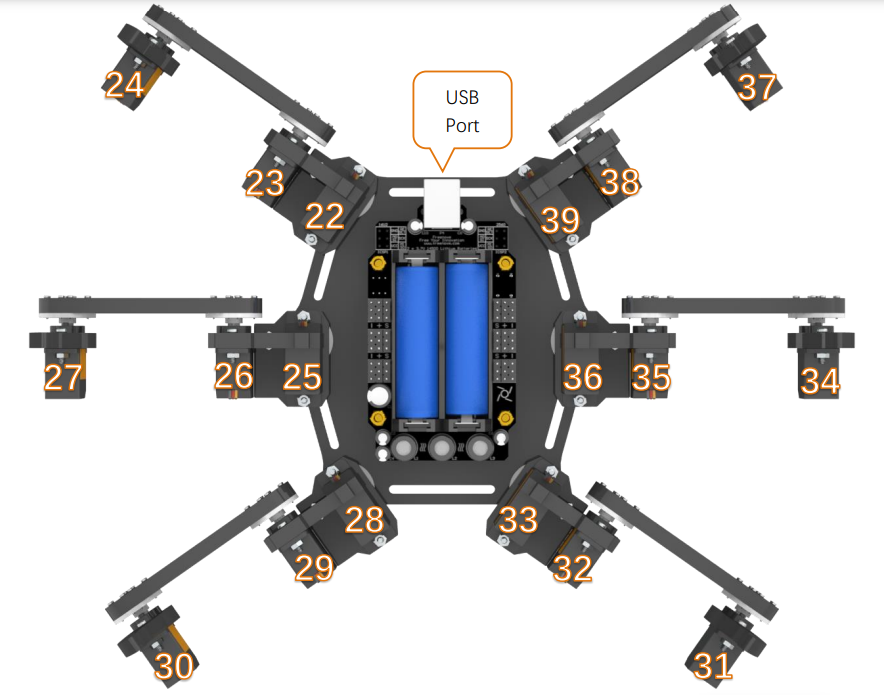
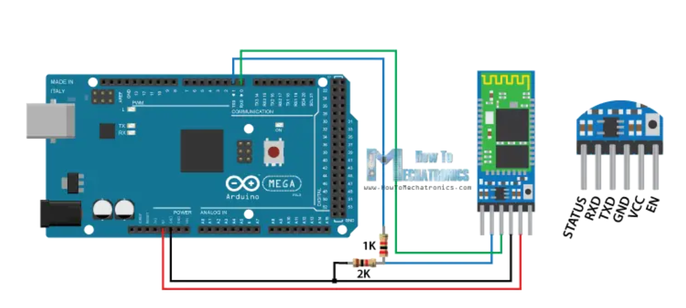

# Hexapod

My project is the Hexapod. A hexapod robot is a robot with 6 legs and it moves using servos, allowing for various unique movements, such as different body orientations and also strafing left and right. I chose this project because it is a very versatile project where I can implement a lot of things to it. For example, I have an autonomous program that uses an ultrasonic sensor to allow the hexapod to detect obstacles and avoid them. I also attached a robotic claw that can be controlled through the Web Bluetooth Terminal on my browser. The claw enables the robot to pick things up.


| **Engineer** | **School** | **Area of Interest** | **Grade** |
|:--:|:--:|:--:|:--:|
| Winston Z | Quarry Lane | Computer Science | Incoming Junior


  
# Final Milestone


<iframe width="560" height="315" src="https://www.youtube.com/embed/1jT4rNYq0Z0?si=xaRzOntqKfJN-NKQ" title="YouTube video player" frameborder="0" allow="accelerometer; autoplay; clipboard-write; encrypted-media; gyroscope; picture-in-picture; web-share" referrerpolicy="strict-origin-when-cross-origin" allowfullscreen></iframe>

## Summary
Since my second milestone, I have implemented an autonomous program using obstacle detection with an ultrasonic sensor. My program has the hexapod move forward until the ultrasonic sensor detects an obstacle. I used the Arduino library "NewPing" to configure the sensor. When it detects something less than 15 centimeters from it, it turns left 90 degrees and checks the left for any obstacles. It then checks the right for obstacles, and turns to the side that does not have obstacles and keeps moving forward. 

## Challenges
My biggest challenge while programming the obstacle detection was getting the sensor to output accurate measurements. Initially, I was using the Arduino's built-in functions to get the distance, but I needed a lot of lines of code for that, and it was inaccurate and inefficient. I then found out about the NewPing library and imported it, making my sensor a lot more efficient and accurate. 

As for the project as a whole, I would say that wiring and configuring the servos was the hardest part for me. Everytime I set a servo to the wrong default position, I had to unscrew it and put it back, and I had to do this multiple times for all 18 servos that the Hexapod consists of. 

## What I learned
This is my second year at BlueStamp Engineering. Prior to attending this program last summer, I had no experience in hardware, such as wiring circuits, assembling parts, and soldering. However, although I am mostly a software person, throughout the course of my time in this program, I found out how much I also love the hardware side of projects, and hope to continue building off the experiences here and explore deeper into the topics of software and hardware.

## Next Steps
I plan to add modifications to my projcet. I plan to add a robotic claw at the front so it can pick something up. It will be controlled by a seperate joystick and I will also try to implement it in autonomous.




# Second Milestone


<iframe width="560" height="315" src="https://www.youtube.com/embed/1lfTrHyL7ps?si=SPMoC00xOcoACDT6" title="YouTube video player" frameborder="0" allow="accelerometer; autoplay; clipboard-write; encrypted-media; gyroscope; picture-in-picture; web-share" referrerpolicy="strict-origin-when-cross-origin" allowfullscreen></iframe>

## Summary
Since my first milestone, I have implemented remote-controlled movement to my Hexapod. I can either use an IDE called "Processing" on my computer to control the robot, or I can use an app on my phone called Freenove. The IDE and app have built-in code that controls the robot.I downloaded an arduino library called "Processing App" and imported it onto the IDE, while for the mobile app I just downloaded it from the app store, so I didn't have to program anything yet, as that will be part of my third milestone, which is autonomous movement with obstacle detection. 

## Challenges
My heavy battery was a problem at first. When I just velcroed it to the bottom of the frame, or the top, the weight distribution around the robot was off, causing it to be off-balance. To solve this, I used CAD and 3D printed a board to mount the battery on, and I fastened the board on top of the frame using standoffs. Another problem I had was wire management. When I was testing the remote-controlled movement before, the servos were rotating in the wrong direction, which was hindering the movement. I spent a long time trouble-shooting and thinking it was a software problem, or that I set the servos to the wrong default positions, but it turns out that I plugged the servos into the wrong pins on my control board, causing them to rotate in the wrong directions. This was due to there being so many wires in such a small space, so I have to be more careful next time.
(To see CAD, scroll down. Units are in millimeters. To see wiring diagram, scroll down)

## Next Steps
As stated before, for my final milestone, I plan to implement an autonomous program that uses an ultrasonic sensor to detect obstacles and avoid them. Also, if I have time, I will add a robotic claw to the robot for another feature.


# First Milestone


<iframe width="560" height="315" src="https://www.youtube.com/embed/yqBxWRG2DWo?si=klUiK1sxId_AdxoZ" title="YouTube video player" frameborder="0" allow="accelerometer; autoplay; clipboard-write; encrypted-media; gyroscope; picture-in-picture; web-share" referrerpolicy="strict-origin-when-cross-origin" allowfullscreen></iframe>


## Summary
My project is the hexapod robot. For my first milestone, I have assembled the robot, which includes 18 servos, the battery, an Arduino control board, and an ESP8266 Wifi module. The Hexapod consists of 6 legs, each of which is controlled by 3 servos. The Arduino control board controls the robot, as I upload code to it to control the servos.

## Challenges
So far, the robot can't move, but I set the default positions for all the servos, so when I press the power button the servos go to their default position, allowing the robot to stand up. Initially, the default positions were out of place, and it took a lot of time to take out each servo and reset the default position to the correct place.

## Next Steps
For the software part of this project, which will be implemented in my 2nd and 3rd milestones, I plan to code an autonomous portion, where the robot moves by itself, and also a remote-controlled portion. I will use the ESP8266 module to connect to my joystick for the remote-controlled portion in my second milestone, which is programmed through an IDE called "Processing." The autonomous portion will be implemented in my third milestone. I will install ultrasonic sensors so it can sense for obstacles, and it will run through the Arduino control board.


# Starter Project

<iframe width="560" height="315" src="https://www.youtube.com/embed/q1qfZzEQkaI?si=5SK6mRZD0XwLfbRt" title="YouTube video player" frameborder="0" allow="accelerometer; autoplay; clipboard-write; encrypted-media; gyroscope; picture-in-picture; web-share" referrerpolicy="strict-origin-when-cross-origin" allowfullscreen></iframe>


My starter project was an RGB board that displays a color. How it works is that there are three sliders that control the color of the light on the board. Every color can be represented by 3 number values that are red blue and green. The sliders determines the value of those 3 colors and the light then displays the color.


# Schematics 

## Starter Project Diagram


## CAD for battery mount(in millimeters)


## Wiring Diagram (Port number will be on the front of the control board)


## Circuit Diagram for Bluetooth HC-08



# Code
<!---
Here's where you'll put your code. The syntax below places it into a block of code. Follow the guide [here]([url](https://www.markdownguide.org/extended-syntax/)) to learn how to customize it to your project needs. 
-->

### Autonomous Obstacle Detection
```c++
#include <NewPing.h>
#include <FNHR.h>

//Defining variables
int trig = 2;
int echo = 3;
FNHR hexapod;
int distance;
int rightdistance;
int leftdistance;
int maximum_distance = 400;
NewPing sonar(trig, echo, maximum_distance);

void setup() {
  //Configuring the sensor and the hexapod
  hexapod.Start();
  pinMode(trig,OUTPUT);
  pinMode(echo,INPUT);
  Serial.begin(9600);

}

//Turning 90 degrees to the right and then sensing for obstacle
int lookRight(){
  for (int i =0;i<16;i++){
    hexapod.TurnRight();
  }
  rightdistance = readPing();
  return rightdistance;
}

//Turning 90 degrees to the left
void turnLeft(){
  for (int i =0;i<13;i++){
    hexapod.TurnLeft();
  }
}

//Turning right 90 degrees
void turnRight(){
  for (int i =0;i<16;i++){
    hexapod.TurnRight();
  }
}

//Turning left 90 degrees then sensing for obstacle
int lookLeft(){
  for (int i =0;i<13;i++){
    hexapod.TurnLeft();
  }
  leftdistance = readPing();
  return leftdistance;
}

//Gets the distance
void getDistance(){
  distance = readPing();


  Serial.print("Distance: ");
  Serial.println(distance);
  
  
}

void loop() {
  rightdistance = 0;
  leftdistance = 0;

  distance = readPing();
  Serial.print("Distance: ");
  Serial.println(distance);

  if (distance<=15){
    //If there is an obstacle near it, then it crawls backward
    hexapod.CrawlBackward();
    hexapod.CrawlBackward();
    //It then checks the left for obstacles
    leftdistance = lookLeft();
    delay(100);
    turnRight();
    delay(100);
    //It checks the right for obstacles
    rightdistance= lookRight();
    delay(100);
    if (leftdistance>=rightdistance){
      //If the closest obstacle to the left is farther away than the closest obstacle on the right, it turns left
      turnLeft();
      turnLeft();
      //Since it is already facing the right, the hexapod just continues on if it decides to keep moving forward right
    }
  }
  else{
    //The robot crawls forward
    hexapod.CrawlForward();
  }


}


int readPing(){
  //The function to get the distance from an obstacle
  delay(70);
  int cm = sonar.ping_cm();
  return cm;
}

```

## Remote Control Using Bluetooth Terminal
```c++

#include <Servo.h>
#include <FNHR.h>

String currentmovement = "Stopped";

FNHR hexapod;
const int servopin = 21;

Servo claw;

void setup() {
  // put your setup code here, to run once:
  Serial3.begin(9600);
  Serial.begin(9600);
  claw.attach(servopin);
  claw.write(90);
  hexapod.Start();
  Serial3.println("o to open claw, c to close claw. WASD to move robot, and Q to turn robot left, E to turn robot right.");

}

void loop() {

  // put your main code here, to run repeatedly:
  if (currentmovement == "moveForward"){
    hexapod.CrawlForward();
  }
  if (currentmovement == "Stopped"){
    hexapod.SleepMode();
  }
  if (currentmovement == "moveBackward"){
    hexapod.CrawlBackward();
  }
  if (currentmovement == "strafeRight"){
    hexapod.CrawlRight();
  }
  if (currentmovement == "strafeLeft"){
    hexapod.CrawlLeft();
  }
  if (currentmovement == "turnLeft"){
    hexapod.TurnLeft();
  }
  if (currentmovement == "turnRight"){
    hexapod.TurnRight();
  }


  if (Serial3.available()){
    char command = Serial3.read();
    if (command == 'c'){
      claw.write(0);
    }
    if (command == 'o'){
      claw.write(90);
    }
    if (command == 'w'){
      currentmovement = "moveForward" ;
    }
    if (command == 's'){
      currentmovement = "moveBackward";
    }
    if (command == '0'){
      currentmovement = "Stopped";
    }
    if (command == 'd'){
      currentmovement = "strafeRight";
    }
    if (command == 'a'){
      currentmovement = "strafeLeft";
    }
    if (command == 'q'){
      currentmovement = "turnLeft";
    }
    if (command == 'e'){
      currentmovement = "turnRight";
    }
  }

}
```


# Bill of Materials

| **Part** | **Note** | **Price** | **Link** |
|:--:|:--:|:--:|:--:|
| RGB Color Slider | Starter Project | $7.99 | <a href="https://www.amazon.com/Arduino-A000066-ARDUINO-UNO-R3/dp/B008GRTSV6(https://www.amazon.com/Soldering-Practice-Learning-Electronics-Training/dp/B0BKM3D927/ref=sxts_b2b_sx_reorder_acb_customer?content-id=amzn1.sym.f63a3b0b-3a29-4a8e-8430-073528fe007f%3Aamzn1.sym.f63a3b0b-3a29-4a8e-8430-073528fe007f&crid=31BMGGPIVNQ9Y&cv_ct_cx=tingbowie+diy+soldering+practice+kit+rgb&dib=eyJ2IjoiMSJ9.Rp97Q3zBJhWEH42AutKwzg.L_RdOYbQTJNYwxc0fgvKasLS9FnuTzz6CJIW5DKLDzg&dib_tag=se&keywords=tingbowie+diy+soldering+practice+kit+rgb&pd_rd_i=B0BKM3D927&pd_rd_r=5d377ea4-3171-4534-86a9-e77dc275c03b&pd_rd_w=dufIe&pd_rd_wg=T9sS9&pf_rd_p=f63a3b0b-3a29-4a8e-8430-073528fe007f&pf_rd_r=DZ1WERVCKDZMWWZM21J7&qid=1719859681&sbo=RZvfv%2F%2FHxDF%2BO5021pAnSA%3D%3D&sprefix=tingbowie+diy+soldering+practice+kit+rgb%2Caps%2C117&sr=1-1-9f062ed5-8905-4cb9-ad7c-6ce62808241a)/"> Link </a> |
| Freenove Hexapod Robot Kit With Controller | Main Project | $126.95 | <a href="https://www.amazon.com/Freenove-Raspberry-Crawling-Detailed-Tutorial/dp/B07FLVZ2DN/ref=asc_df_B07FLVZ2DN/?tag=hyprod-20&linkCode=df0&hvadid=692875362841&hvpos=&hvnetw=g&hvrand=18317927699298684350&hvpone=&hvptwo=&hvqmt=&hvdev=c&hvdvcmdl=&hvlocint=&hvlocphy=9032183&hvtargid=pla-2281435177618&mcid=cd179c3d961631ab9022bc5774d9b3fe&hvocijid=18317927699298684350-B07FLVZ2DN-&hvexpln=73&gad_source=1&th=1)/"> Link </a> |

